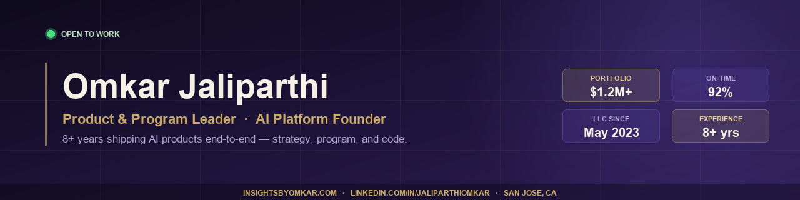

  

  
  
  
  
  

---

### About

Product & Program leader who ships. 8+ years running multi-team delivery across **$1.2M+ portfolios**. Most recently: designed and shipped a production AI SaaS solo in **6 weeks** — strategy, program, and code.

Founded **Omkar's Holistic Services LLC** (DBA *Insights by Omkar*) in May 2023; its flagship AI platform went live in March 2026. PRD → Figma → Jira → production code → postmortem. I don't hand off work I can't do myself.

---

### Numbers

<table>
<tr>
<td><b>$1.2M+</b> Portfolio scale</td>
<td><b>92%</b> On-time delivery</td>
<td><b>58%</b> Faster MTTR</td>
<td><b>95%+</b> SLA adherence</td>
<td><b>30%</b> Fewer post-release defects</td>
<td><b>6 weeks</b> Solo SaaS ship</td>
</tr>
</table>

---

### Work

<table width="100%">
<tr>
<td width="50%" valign="top">

#### 🔮 Insights by Omkar &nbsp; <i>live · v2.2.0 · private repo</i>
AI consumer SaaS with multi-model governance. 1,200+ library entries · 5 paid AI chambers · 33 admin panels · 100+ schema-enriched pages.

**Role:** Founder · Product · Program · Engineering
**Business:** Omkar's Holistic Services LLC (DBA) · *May 2023 →*
**Ship:** 6-week core · ongoing hardening · v0.01 → v2.2.0

`Next.js 16` · `Supabase + RLS` · `Stripe + PayPal` · `Claude + GPT-4o` · `Resend` · `Vercel`

**Standouts:** two-stage AI content governance (Chandra + Surya quality → Brahma + Vishnu + Shiva strategy, with dual-model consensus) · atomic credit architecture with automatic refund · live audit plane (`project_plans`, `project_decisions`, `error_log`, `intelligence_recommendations`, `cron_log`)

→ [Live product](https://www.insightsbyomkar.com)
→ [Case study](https://github.com/omkarjaliparthi/insights-by-omkar-case-study)

</td>
<td width="50%" valign="top">

#### 🌟 Tuffy's AI Astrology &nbsp; <i>public · live demo</i>
Structured-output AI consumer product.

**Thesis:** clarity over verbosity. Systems over one-offs.

`Next.js` · `TypeScript` · `OpenAI`

→ [Live demo](https://tuffys-ai-astrology.vercel.app)
→ [Source](https://github.com/omkarjaliparthi/tuffys-ai-astrology)

</td>
</tr>
<tr>
<td width="50%" valign="top">

#### 🏥 MediLink &nbsp; <i>capstone</i>
Healthcare records platform unifying patient data across providers.

**Role:** PM · 10-person team · 6 sprints
**Outcomes:** 30%+ repeat-defect prevention · 35% fewer blockers

→ [Source & team](https://github.com/omkarjaliparthi/medilink)

</td>
<td width="50%" valign="top">

#### 📋 TPM × PM Portfolio &nbsp; <i>artifacts</i>
PRDs, RFCs, launch checklists, postmortems, status rollups — from shipped programs.

→ [Browse](https://github.com/omkarjaliparthi/tpm-portfolio)

</td>
</tr>
</table>

---

### Strengths

**Product** — 0→1 discovery · structured-output AI UX · pricing & packaging · scoping
**Program** — versioned releases · pre-launch governance · incident response · ops scheduling
**Engineering** — full-stack TS/Next.js · Supabase + RLS · payment webhooks · multi-provider AI
**Business** — unit economics · chargeback defense · refund policy design · subscription modeling

---

### Toolkit

`Jira` · `Confluence` · `Figma` · `ServiceNow` · `SAFe` · `Scrum` · `OKRs`
`TypeScript` · `Python` · `Java` · `Kotlin` · `SQL` · `Next.js` · `Supabase`
`GCP` · `BigQuery` · `Stripe` · `OpenAI` · `Anthropic` · `TensorFlow`

---

### Credentials

| | |
|---|---|
| **M.S. Computer Science** | Pace University, NY · *Software Development & AI* · 2024 |
| **LL.B.** | *Regulatory, contracts, governance* · 2021 |
| **ICWA Intermediate** | ICAI-CMA · *Cost & management accounting* · 2020 |
| **B.Tech, Robotics** | V R Siddhartha Engineering College · 2017 |
| **Certifications** | Atlassian APM · SAFe 6 Agilist · Certified Scrum Master · IBM Deep Learning · Six Sigma Green Belt |

---

<b>Open to Senior PM · TPM · Founding PM roles</b> 
AI platforms · Developer tooling · Infra · Consumer · Fintech · Healthtech

<a href="mailto:Jaliparthiomkar03@gmail.com">Jaliparthiomkar03@gmail.com</a>
&nbsp;·&nbsp; <a href="https://www.linkedin.com/in/jaliparthiomkar">LinkedIn</a>
&nbsp;·&nbsp; <a href="https://www.insightsbyomkar.com">insightsbyomkar.com</a>

<!--
Recruiter keywords:
Technical Program Manager, Senior TPM, Staff TPM, Program Manager, Product Manager,
Senior Product Manager, Staff Product Manager, Principal PM, Founding PM, Founding TPM,
Product Operations, Product Ops Lead, Growth PM, Platform PM, Consumer PM, AI PM,
AI platforms, LLM, GenAI, 0 to 1, founding team, Agile, Scrum, SAFe, RAID, OKRs,
Jira, Confluence, Figma, GCP, BigQuery, Supabase, Next.js, OpenAI, Anthropic, Stripe, TensorFlow,
San Jose, Bay Area, San Francisco, Silicon Valley, Palo Alto, Mountain View, Sunnyvale,
FAANG, Google, Meta, Apple, Amazon, Microsoft, Airbnb, Stripe, Anthropic, OpenAI, hiring.
-->
